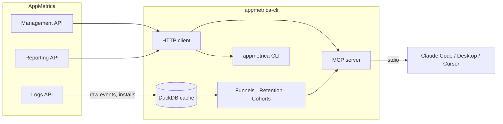

# appmetrica-cli

**Read-only CLI and MCP server for [AppMetrica](https://appmetrica.yandex.com/) game analytics.** Ask analytics questions in plain language from Claude Code, Claude Desktop, or Cursor — no dashboards, no spreadsheets.

[Русская версия](./README.ru.md)


## Why

AppMetrica's own dashboards are built for scrolling and clicking. This tool is built for asking:

- *"What's DAU by country for the last 30 days?"*
- *"Build a funnel from `level_start` to `level_finish` for the US, Facebook only"*
- *"D3/D1 retention ratio for the cohort that installed May 1–7"*
- *"Compare Facebook vs organic cohorts on retention and session count"*

It talks to AppMetrica's real APIs, caches raw events locally in DuckDB when a question needs raw data (funnels, deep retention, cohorts), and hands the numbers to your LLM client as MCP tools — or straight to your terminal as JSON.

## Features

- 🔒 **Read-only by construction.** Every HTTP call is a `GET`. No write endpoint is ever called.
- 🔑 **Token stays out of plaintext.** Stored in the OS credential store (macOS Keychain, Windows Credential Manager, Linux Secret Service) — never on disk, never printed, never logged.
- 📊 **15 MCP tools** across discovery, ad-hoc reporting, preset reports, and raw-data analytics (funnels, deep retention, cohort comparison).
- 🧠 **Local DuckDB cache** for anything the Reporting API can't answer directly — funnels and cohort-level retention are computed from cached raw events, not estimated.
- 🗂️ **No hardcoded event taxonomy.** You tell it your event names (`level_start`, `iap_purchase`, whatever your game calls them); it never assumes a schema.
- 🖥️ **CLI + MCP in one package.** Same auth, same client, two ways in.

## How it works



- **Management API** — list the apps your token can see.
- **Reporting API** — aggregated metrics (DAU, sessions, crashes, installs, geo). Fast, no local storage.
- **Logs API** — raw event/install export (async: `202` → poll → `200`), cached locally in DuckDB so funnels, deep retention, and cohort comparisons don't need to re-export on every question.

## Quick start

Requires Python ≥3.10 and [uv](https://docs.astral.sh/uv/).

```bash
# 1. Clone and install
git clone https://github.com/ampersante/appmetrica-cli.git
cd appmetrica-cli
uv sync

# 2. Get an AppMetrica OAuth token (see below), then log in
uv run appmetrica auth login

# 3. Check it's working
uv run appmetrica auth status

# 4. Run a report, or start the MCP server
uv run appmetrica mcp
```

### Getting an AppMetrica OAuth token

1. Go to [oauth.yandex.com/client/new](https://oauth.yandex.com/client/new) and create an app.
2. Grant it the **`appmetrica:read`** permission (read-only access to AppMetrica).
3. Follow Yandex OAuth's flow to obtain a token for that app.
4. Run `appmetrica auth login` and paste the token when prompted (or pipe it: `appmetrica auth login --stdin`).

The token is validated against the API immediately and then stored in your OS credential store — it is never written to disk in plaintext.

## CLI usage

```bash
$ appmetrica auth login
AppMetrica OAuth token: ********
{
  "stored_in": "keychain",
  "apps_visible": 3
}

$ appmetrica auth status
{
  "source": "keychain",
  "valid": true,
  "apps_visible": 3
}

$ appmetrica auth logout
{
  "deleted": true
}

$ appmetrica mcp
# starts the MCP server over stdio
```

`auth status` and `auth login` never print the token itself — only where it came from and whether it works. Exit codes are stable and scriptable: `2` = API rejected the token, `3` = credential-store error, `4` = configuration error (bad token format, conflicting env vars, unsafe token file permissions).

For servers/CI without an OS credential store, set `APPMETRICA_OAUTH_TOKEN` directly, or point `APPMETRICA_OAUTH_TOKEN_FILE` at a file owned by the running user with `chmod 600` permissions.

## MCP usage

Add the server to your MCP client config (Claude Code `.mcp.json`, Claude Desktop config, Cursor, etc.), pointing `--project` at wherever you cloned the repo:

```json
{
  "mcpServers": {
    "appmetrica": {
      "command": "uv",
      "args": ["run", "--project", "/path/to/appmetrica-cli", "appmetrica", "mcp"]
    }
  }
}
```

Auth works the same way as the CLI — the server reads from the OS credential store (or `APPMETRICA_OAUTH_TOKEN` / `APPMETRICA_OAUTH_TOKEN_FILE`) at startup.

### 15 tools

| Group | Tools | Source |
|---|---|---|
| Discovery | `list_apps`, `list_metrics` | Management API |
| Universal query | `get_report`, `get_drilldown` | Reporting API |
| Preset reports | `get_traffic`, `get_installs`, `get_crashes`, `get_geo`, `get_events`, `get_devices`, `get_versions` | Reporting API |
| Raw-data analytics | `build_funnel_report`, `compare_cohorts_report`, `get_deep_retention`, `sync_events` | Logs API + local DuckDB |

Plus two MCP prompt templates: `daily_analytics_check` and `compare_periods`.

`get_report` and `get_drilldown` accept any metric/dimension combination the Reporting API supports — call `list_metrics` first to see the live catalog. The preset tools cover the common questions (traffic, installs, crashes, geo, events, devices, versions) with a `group_by` shortcut. The raw-data tools sync events and installs from the Logs API into a local DuckDB cache on first call, then compute funnels, deep retention (any day combination, with optional ratios like D3/D1), and side-by-side cohort comparisons.

## Security

- **Read-only.** Only `GET` requests are made against AppMetrica's APIs. There is no code path that writes, imports, or modifies anything in AppMetrica.
- **No plaintext token, ever.** The token lives in the OS credential store and is never written to a config file, log, or error message.

| Platform | Credential store | Verified |
|---|---|---|
| macOS | Keychain | Unit-tested (mocked backend); developed and manually exercised on macOS |
| Linux | Secret Service | Unit-tested (mocked backend) |
| Windows | Credential Manager | Unit-tested (mocked backend) only — not run on real Windows yet |

- **CI / headless environments:** use `APPMETRICA_OAUTH_TOKEN` (env var) or `APPMETRICA_OAUTH_TOKEN_FILE` (a file that must be owned by the current user and have `600` permissions — checked before every read).
- **Scriptable failures.** Auth commands exit `2` (token rejected by the API), `3` (credential-store error), or `4` (configuration error), never a generic `1`, so wrapper scripts can branch on the actual cause.
- **No hardcoded credential-store redirection.** Environment variables that could silently redirect keyring's backend (`PYTHON_KEYRING_BACKEND`, `KEYRING_PROPERTY_*`) are explicitly refused rather than honored.

## Roadmap

Not available yet — do not assume these exist:

- [ ] `appmetrica sync` / `appmetrica build` as CLI commands (the loader/storage modules exist internally but aren't wired to the CLI yet)
- [ ] `appmetrica reconcile` for cache-vs-API consistency checks
- [ ] Ad-hoc SQL query surface over the local cache
- [ ] Packaged install (Homebrew / standalone binary) — for now, install from source with `uv`
- [ ] License decision (see below)

## Contributing

```bash
uv sync --extra dev
uv run pytest -v
```

96 tests, no network calls in the test suite (HTTP is mocked with `respx`). PRs welcome — please keep the read-only guarantee intact and add tests for new code.

More detail on the internals: [architecture.md](./architecture.md) and [engineering-rules.md](./engineering-rules.md) (partly in Russian).

## License

Not chosen yet — the repository owner will pick a license before wider distribution. Until then, treat this as "all rights reserved" source-available code.
