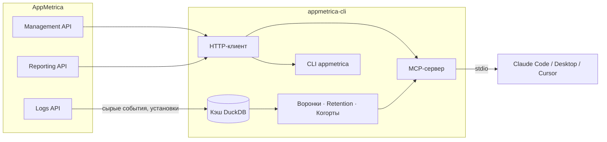

# appmetrica-cli

**Read-only CLI и MCP-сервер для игровой аналитики [AppMetrica](https://appmetrica.yandex.com/).** Задавайте аналитические вопросы на обычном языке прямо из Claude Code, Claude Desktop или Cursor — без дашбордов и таблиц.

[English version](./README.md)


## Зачем

Штатные дашборды AppMetrica заточены под скроллинг и клики. Этот инструмент — под вопросы:

- *«Какой DAU по странам за последние 30 дней?»*
- *«Построй воронку level_start → level_finish для США, только Facebook»*
- *«Какое соотношение D3/D1 retention у когорты, установившей приложение 1–7 мая?»*
- *«Сравни когорты Facebook и organic по retention и числу сессий»*

Сервер обращается к реальным API AppMetrica, кэширует сырые события в DuckDB, когда вопросу нужны сырые данные (воронки, глубокий retention, когорты), и отдаёт числа вашему LLM-клиенту как MCP-инструменты — либо сразу в терминал в виде JSON.

## Возможности

- 🔒 **Read-only по конструкции.** Каждый HTTP-запрос — `GET`. Ни один write-эндпоинт никогда не вызывается.
- 🔑 **Токен не хранится в открытом виде.** Хранится в системном хранилище учётных данных (macOS Keychain, Windows Credential Manager, Linux Secret Service) — никогда не записывается в открытом виде, никогда не печатается, никогда не логируется.
- 📊 **15 MCP-инструментов**: discovery, произвольные отчёты, пресеты и аналитика по сырым данным (воронки, глубокий retention, сравнение когорт).
- 🧠 **Локальный кэш DuckDB** для всего, что Reporting API не умеет посчитать напрямую — воронки и retention по когортам считаются из кэшированных сырых событий, а не оцениваются приблизительно.
- 🗂️ **Никакой зашитой таксономии событий.** Вы сами называете свои события (`level_start`, `iap_purchase` — любые названия вашей игры); сервер никогда не предполагает готовую схему.
- 🖥️ **CLI и MCP в одном пакете.** Общая авторизация, общий клиент, два способа доступа.

## Как это работает



- **Management API** — список приложений, доступных вашему токену.
- **Reporting API** — агрегированные метрики (DAU, сессии, крэши, установки, гео). Быстрые ответы, без локального хранения.
- **Logs API** — экспорт сырых событий и установок (асинхронно: `202` → опрос → `200`), кэшируется локально в DuckDB, чтобы воронки, глубокий retention и сравнение когорт не требовали повторного экспорта на каждый вопрос.

## Быстрый старт

Нужен Python ≥3.10 и [uv](https://docs.astral.sh/uv/).

```bash
# 1. Клонировать и установить
git clone https://github.com/ampersante/appmetrica-cli.git
cd appmetrica-cli
uv sync

# 2. Получить OAuth-токен AppMetrica (см. ниже), затем авторизоваться
uv run appmetrica auth login

# 3. Проверить, что всё работает
uv run appmetrica auth status

# 4. Запустить MCP-сервер
uv run appmetrica mcp
```

### Как получить OAuth-токен AppMetrica

1. Перейдите на [oauth.yandex.com/client/new](https://oauth.yandex.com/client/new) и создайте приложение.
2. Выдайте ему право **`appmetrica:read`** (доступ к AppMetrica только на чтение).
3. Пройдите стандартный флоу Yandex OAuth и получите токен для этого приложения.
4. Выполните `appmetrica auth login` и вставьте токен при запросе (либо передайте через пайп: `appmetrica auth login --stdin`).

Токен сразу проверяется реальным запросом к API, а затем сохраняется в системном хранилище учётных данных — он никогда не записывается на диск в открытом виде.

## Использование CLI

```bash
$ appmetrica auth login
AppMetrica OAuth token: ********
{
  "stored_in": "keychain",
  "apps_visible": 3
}

$ appmetrica auth status
{
  "source": "keychain",
  "valid": true,
  "apps_visible": 3
}

$ appmetrica auth logout
{
  "deleted": true
}

$ appmetrica mcp
# запускает MCP-сервер поверх stdio
```

`auth status` и `auth login` никогда не печатают сам токен — только откуда он взят и работает ли он. Коды завершения стабильны и пригодны для скриптов: `2` — API отклонил токен, `3` — ошибка хранилища учётных данных, `4` — ошибка конфигурации (неверный формат токена, конфликтующие переменные окружения, небезопасные права на файл с токеном).

Для серверов/CI без системного хранилища учётных данных задайте `APPMETRICA_OAUTH_TOKEN` напрямую, либо укажите в `APPMETRICA_OAUTH_TOKEN_FILE` путь к файлу, принадлежащему текущему пользователю, с правами `chmod 600`.

## Использование через MCP

Добавьте сервер в конфиг вашего MCP-клиента (`.mcp.json` для Claude Code, конфиг Claude Desktop, Cursor и т.д.), указав в `--project` путь до склонированного репозитория:

```json
{
  "mcpServers": {
    "appmetrica": {
      "command": "uv",
      "args": ["run", "--project", "/path/to/appmetrica-cli", "appmetrica", "mcp"]
    }
  }
}
```

Авторизация работает так же, как в CLI — сервер при старте читает токен из системного хранилища (либо из `APPMETRICA_OAUTH_TOKEN` / `APPMETRICA_OAUTH_TOKEN_FILE`).

### 15 инструментов

| Группа | Инструменты | Источник |
|---|---|---|
| Discovery | `list_apps`, `list_metrics` | Management API |
| Универсальные запросы | `get_report`, `get_drilldown` | Reporting API |
| Пресет-отчёты | `get_traffic`, `get_installs`, `get_crashes`, `get_geo`, `get_events`, `get_devices`, `get_versions` | Reporting API |
| Аналитика по сырым данным | `build_funnel_report`, `compare_cohorts_report`, `get_deep_retention`, `sync_events` | Logs API + локальный DuckDB |

Плюс два шаблона MCP-промптов: `daily_analytics_check` и `compare_periods`.

`get_report` и `get_drilldown` принимают любую комбинацию метрик и измерений, которую поддерживает Reporting API — сначала вызовите `list_metrics`, чтобы увидеть актуальный каталог. Пресет-инструменты закрывают типовые вопросы (трафик, установки, крэши, гео, события, устройства, версии) с быстрым `group_by`. Инструменты по сырым данным при первом вызове синхронизируют события и установки из Logs API в локальный кэш DuckDB, а затем считают воронки, глубокий retention (любая комбинация дней, с опциональными соотношениями вроде D3/D1) и посайдовое сравнение когорт.

## Безопасность

- **Read-only.** К API AppMetrica уходят только `GET`-запросы. В коде нет пути, который бы что-то записывал, импортировал или изменял в AppMetrica.
- **Токен никогда не в открытом виде.** Токен живёт в системном хранилище учётных данных и никогда не записывается в конфиг, лог или текст ошибки.

| Платформа | Хранилище учётных данных | Проверено |
|---|---|---|
| macOS | Keychain | Юнит-тесты; вручную проверено на реальном Keychain |
| Linux | Secret Service | Юнит-тесты; вручную проверено в Docker на реальном GNOME Keyring (вход, чтение, удаление) и без хранилища (понятный отказ) |
| Windows | Credential Manager | Только юнит-тесты (с мок-бэкендом) — на реальной Windows пока не запускалось |

- **CI / серверные окружения без интерфейса:** используйте `APPMETRICA_OAUTH_TOKEN` (переменная окружения) или `APPMETRICA_OAUTH_TOKEN_FILE` (файл, который должен принадлежать текущему пользователю и иметь права `600` — проверяется перед каждым чтением).
- **Предсказуемые коды ошибок.** Команды авторизации завершаются с кодом `2` (токен отклонён API), `3` (ошибка хранилища) или `4` (ошибка конфигурации), никогда просто `1` — обёрточные скрипты могут различать причину.
- **Без скрытого перенаправления хранилища.** Хранилище закреплено для каждой ОС: `PYTHON_KEYRING_BACKEND` и `keyringrc.cfg` игнорируются, а при любой переменной `KEYRING_PROPERTY_*` авторизация отказывается работать (код `4`), чтобы нельзя было подменить место хранения токена.

## Roadmap

Пока не реализовано — не считайте, что это уже доступно:

- [ ] `appmetrica sync` / `appmetrica build` как команды CLI (модули loader/storage существуют внутри кода, но ещё не подключены к CLI)
- [ ] `appmetrica reconcile` для проверки согласованности кэша и API
- [ ] Произвольные SQL-запросы к локальному кэшу
- [ ] Пакетная установка (Homebrew / отдельный бинарник) — пока установка только из исходников через `uv`
- [ ] Переделка инструментов для сырых данных (`build_funnel_report`, `get_deep_retention`, `compare_cohorts_report`) на новый загрузчик — сейчас они работают на старом кэше с известными проблемами точности (окна шагов воронки, нестрогое сопоставление источников, подсчёт сессий); их цифры пока предварительные
- [ ] Выбор лицензии (см. ниже)

## Contributing

```bash
uv sync --extra dev
uv run pytest -v
```

96 тестов, тестовый набор не делает реальных сетевых запросов (HTTP замокан через `respx`). PR приветствуются — пожалуйста, сохраняйте read-only гарантию и добавляйте тесты для нового кода.

Подробнее об устройстве проекта: [architecture.md](./architecture.md) и [engineering-rules.md](./engineering-rules.md) (частично на русском).

## Лицензия

Пока не выбрана — владелец репозитория определится с лицензией перед более широким распространением проекта. До этого момента считайте код доступным для просмотра, но защищённым всеми правами («all rights reserved»).
